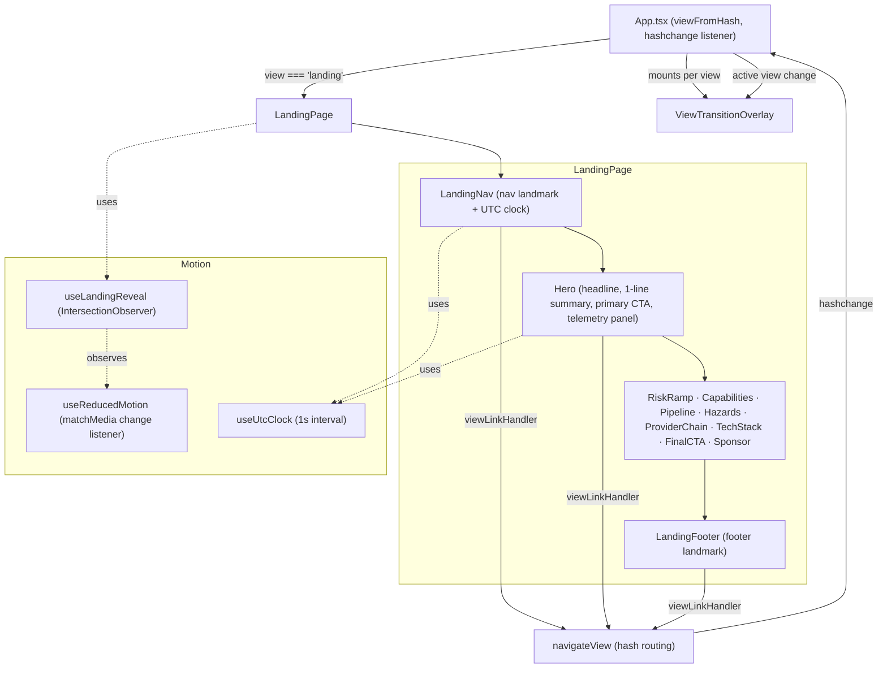
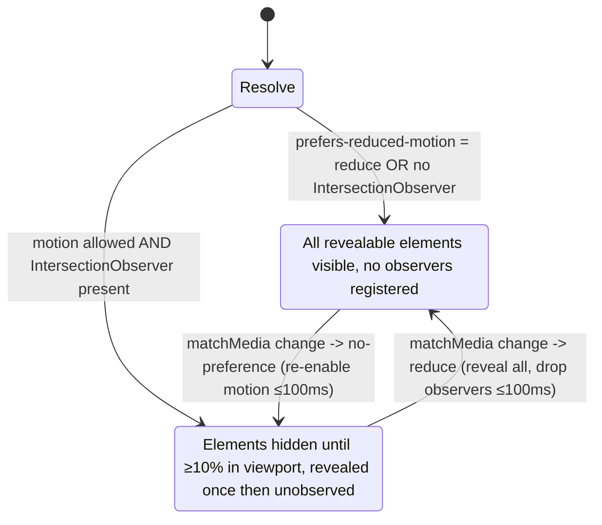

# Design Document

## Overview

This design refreshes the AutoOutlook landing page UX, animation, accessibility,
and responsiveness while preserving the existing brutalist / retro identity and
the page's information architecture and routing. The work is concentrated in
three existing files plus their styles:

- `src/components/landing/LandingPage.tsx` — the component tree, the reveal hook
  (`useLandingReveal`), the UTC clock hook (`useUtcClock`), the stagger helpers
  (`revealDelay`, `heatDelay`), and the section markup.
- `src/components/ViewTransitionOverlay.tsx` — the shared navigation transition
  overlay.
- `src/index.css` — the brutalist component classes (`.retro-*`), the landing
  motion utilities (`.landing-*`), and the `prefers-reduced-motion` block.
- `tailwind.config.ts` — the design tokens (palette, fonts, shadows, keyframes).

The refresh is deliberately **token-bounded** (no new colors, shadows, or type
roles), **motion-bounded** (compositor-only `transform`/`opacity`, single reveal
per element, reduced-motion-aware), and **structure-preserving** (the section
order from hero through footer is fixed and routing still flows through the
shared `viewLinkHandler`).

### Current-state findings (grounding)

Reading the current implementation surfaced the gaps this design must close:

| Area | Current behavior | Requirement | Action |
| --- | --- | --- | --- |
| Hero CTAs | Hero renders **three** action buttons (Dashboard, Docs, Risk Archive) plus a "How it works" link | 2.2 (exactly one primary + one secondary) | Reduce to one primary (dashboard) + one secondary (docs); demote extras to in-page link/secondary nav |
| Hero summary | Multi-line, long product paragraph; no constrained single-line summary | 2.1 (≤140 char single-line summary, hero fits desktop viewport) | Add a dedicated one-line summary element; condense hero so headline + summary + primary CTA fit `100vh` at desktop |
| Hero across viewports | Hero presentation rendered on all viewports | 2.7 (desktop-only hero presentation) | Gate the desktop hero presentation to the desktop breakpoint; do not render it on mobile/tablet |
| Reveal threshold | `IntersectionObserver` threshold `0.14`, `rootMargin '0px 0px -10% 0px'` | 3.1 (fire at ≥10% visible) | Set threshold to `0.1` |
| Stagger delays | `revealDelay` callers use deltas of 24ms (tech pills), 44ms, 50–90ms | 3.3 (50–200ms successive) | Clamp per-step stagger into [50, 200]ms |
| Reduced-motion runtime toggle | `useLandingReveal` reads `prefers-reduced-motion` once at mount; no change listener | 4.3, 4.6 (respond when mode toggles within 100ms) | Subscribe to `matchMedia` `change`; re-resolve reveal/observer state on toggle |
| Heat-cell pulse | `landingHeatPulse` animates `filter: saturate()/brightness()` | 7.1 (only transform/opacity) | Re-express pulse using `opacity`/`transform` only |
| Overlay duration | `TOTAL_MS = 2500`, `EXIT_AT_MS = 2100` | 9.4 (fixed 600ms display) | Make display duration 600ms (single source of truth) |
| Rapid re-navigation | Overlay keyed only on `view`; `cycle` hardcoded `0` | 9.5 (single overlay to most-recent destination) | Drive overlay from latest requested view; coalesce to one overlay |
| Anchor / route failure | Plain anchors no-op on missing target; no failure signal on route resolve failure | 2.4, 9.6 (retain position/view + indicate unavailable) | Add guarded anchor + view-link handling with a non-intrusive unavailable indication |
| Landmarks / names | Top bar is a `<header>` with no `<nav>` landmark or accessible name | 5.3 (named nav/main/footer landmarks) | Add a labeled `<nav>` landmark and accessible names |
| Mobile hit targets | Nav anchors are small inline text | 6.5 (≥44×44 CSS px on mobile) | Enforce minimum touch target sizing at mobile breakpoint |

### Design principles

1. **Tokens only.** Every color, border, shadow, and type role resolves to an
   existing `tailwind.config.ts` token. Fallbacks default to the base token
   rather than introducing a new value.
2. **One reveal, compositor-only.** Each revealable element transitions once,
   then is unobserved; all decorative motion animates `transform`/`opacity`
   exclusively.
3. **Reduced motion is reactive, not just initial.** Motion state responds to OS
   changes at runtime, not only at first mount.
4. **Behavior is centralized.** Timing constants (reveal duration, stagger
   bounds, overlay duration, clock interval) live in named constants so tests
   and code share one source of truth.

## Architecture

The landing page is a self-contained React subtree mounted by `App.tsx` when the
resolved view is `landing`. Routing remains hash-based and flows through
`navigateView` / `viewLinkHandler`. The navigation transition overlay is mounted
by `App.tsx` alongside each view.



### Motion control flow

The reveal/reduced-motion interaction is the most behavior-sensitive part of the
refresh, so it is modeled explicitly:



## Components and Interfaces

### `useReducedMotion()` (new hook, extracted)

Centralizes reduced-motion detection so both the reveal system and decorative
animation gating react to runtime OS changes.

```ts
// Returns the live reduced-motion preference, updating on OS/browser change.
function useReducedMotion(): boolean;
```

- Reads `window.matchMedia('(prefers-reduced-motion: reduce)')`.
- Subscribes to its `change` event; cleans up on unmount.
- SSR-safe: returns `false` when `window` is undefined.

### `useLandingReveal(reducedMotion: boolean)` (revised)

```ts
function useLandingReveal(reducedMotion: boolean): void;
```

- When `reducedMotion` is true **or** `IntersectionObserver` is unavailable: set
  `data-landing-visible="true"` on every `[data-landing-reveal]` element and
  register **no** observers.
- Otherwise: observe each target with `threshold: 0.1` and
  `rootMargin: '0px 0px -10% 0px'`; on intersection set
  `data-landing-visible="true"` and `unobserve` the element (reveal once).
- Re-runs its effect when `reducedMotion` changes so a runtime toggle reveals all
  elements (toggle → reduce) or re-arms observers for not-yet-revealed elements
  (toggle → no-preference) within one effect flush.

### `useUtcClock()` (unchanged contract, consolidated)

```ts
function useUtcClock(): { time: string; timeFull: string; date: string };
// timeFull formatted as HH:MM:SSZ (two-digit zero-padded, colon-separated, Z suffix)
```

- 1000ms `setInterval`, cleared on unmount.
- Continues updating regardless of reduced-motion state (the clock is
  informational, not decorative).

### Stagger helpers (revised)

```ts
const REVEAL_STAGGER_MIN_MS = 50;
const REVEAL_STAGGER_MAX_MS = 200;

// Clamp a per-index stagger into the accessible/spec-compliant band.
function staggerDelay(index: number, stepMs: number, baseMs?: number): CSSProperties;
```

- `staggerDelay` computes `base + index * step` but clamps the **successive
  delta** so each element trails its predecessor by 50–200ms.
- `heatDelay` (decorative heat grid) remains a pure index→delay function; its
  output is used only for `animation-delay` on a compositor-only animation.

### `LandingNav` (revised)

- Wrap primary links in a `<nav aria-label="Primary">` landmark.
- In-page anchors (`#capabilities`, `#pipeline`, `#landing-hazards`, `#stack`)
  use a guarded scroll handler (below). Cross-view links keep `viewLinkHandler`.
- Mobile: interactive controls get a minimum 44×44 CSS px hit area.

### `Hero` (revised)

- One `<h1>` headline (existing).
- One **single-line product summary**, ≤140 characters, in its own element.
- Exactly **one primary CTA** routing to `#dashboard` and exactly **one
  secondary CTA** routing to `#docs`. The former "2026 Risk Archive" and "How it
  works" actions move out of the primary action row (into the section body / a
  tertiary text link) so the hero presents a single primary + single secondary.
- Layout condensed so headline + summary + primary CTA sit within the initial
  desktop viewport height.

### Guarded in-page navigation (new helper)

```ts
// Scrolls to an in-page section if present; otherwise retains position and
// surfaces a transient "section unavailable" indication.
function scrollToSection(id: string): { ok: boolean };
```

- If `document.getElementById(id)` exists: `scrollIntoView({ block: 'start' })`
  (section honors `scroll-mt-20` so its heading lands at/below the sticky nav).
- If absent: do not change scroll position; set a transient state that renders an
  unobtrusive, accessible "section unavailable" message (`role="status"`).

### `ViewTransitionOverlay` (revised) + `App.tsx` wiring

- Display duration becomes a single fixed constant:

```ts
const OVERLAY_DISPLAY_MS = 600; // total visible duration before unmount
```

- The overlay remounts on each active-view change (keyed by view + a monotonically
  increasing `cycle` bumped by `App.tsx` on every view change). When multiple
  view changes occur in quick succession, `App.tsx` resolves to the **most
  recent** destination and renders a **single** overlay for it (coalesced via the
  `view`/`cycle` key, not one overlay per intermediate request).
- Reduced motion: the overlay renders its destination state without looping
  decorative motion (radar sweep, blink, pulse suppressed by the existing
  `prefers-reduced-motion` block; load bar shown filled).
- If `navigateView` cannot resolve a destination view, `App.tsx` retains the
  current active view and surfaces a non-blocking indication that the view change
  did not complete.

### Token usage contract (Requirement 1)

| Role | Allowed tokens (from `tailwind.config.ts` / `index.css`) |
| --- | --- |
| Color | `paper`, `ink`, `navy`, `signal.{red,amber,orange,lime,cyan,violet}`, `risk.{tstm,mrgl,slgt,enh,mod,high}` |
| Border | `border-ink` heavy outlines (`border-[2px]`/`[3px]`/`[4px]`) |
| Shadow | `shadow-retro`, `shadow-retro-sm`, `shadow-retro-lg`, `shadow-retro-inset` (no blur/soft shadow) |
| Type | `font-display` (headings), `font-mono` (labels), `font-sans` (body) |

Any new element that cannot map a property to an existing token falls back to the
base token for that property (e.g. color → `ink`, shadow → `shadow-retro`).

## Data Models

The landing page holds no persistent domain data; its "models" are the static
content arrays and the small runtime/config types that govern behavior.

```ts
// Responsive breakpoint band (Viewport_Class).
type ViewportClass = 'mobile' | 'tablet' | 'desktop';
// mobile: width < 640px; tablet: 640–1023px; desktop: ≥1024px

// Reveal element contract (DOM data attributes).
interface RevealElement {
  // marks the element for the reveal system
  'data-landing-reveal': 'true';
  // set by the reveal system when the element becomes visible (once)
  'data-landing-visible'?: 'true';
  // optional per-element stagger delay (CSS custom property)
  style?: { '--landing-reveal-delay'?: string };
}

// Motion timing constants (single source of truth).
interface MotionConfig {
  REVEAL_DURATION_MS: number;        // within [300, 800], e.g. 560
  REVEAL_THRESHOLD: number;          // 0.1  (≥10% visible)
  REVEAL_STAGGER_MIN_MS: number;     // 50
  REVEAL_STAGGER_MAX_MS: number;     // 200
  CLOCK_INTERVAL_MS: number;         // 1000
  OVERLAY_DISPLAY_MS: number;        // 600
  MOTION_TOGGLE_BUDGET_MS: number;   // 100 (suppress/re-enable budget)
}

// UTC clock display model.
interface ClockDisplay {
  time: string;      // "HHMM" + "Z"  (compact)
  timeFull: string;  // "HH:MM:SSZ"   (Requirement 8.4 format)
  date: string;      // "YYYY-MM-DD"
}

// Navigation transition view identity (existing).
type TransitionView = 'landing' | 'dashboard' | 'docs' | 'changelog';

// Static content models (existing, unchanged shapes):
//   RiskCategory order, RISK_DESCRIPTORS, CAPABILITIES[], PIPELINE_STEPS[],
//   HAZARDS[], PROVIDER_TIERS[], TECH_PILLS[]
// Section heading model (Requirement 2.6): exactly one non-empty tag + one non-empty title.
interface SectionHeading { tag: string; title: string; dark?: boolean }
```

### UTC clock formatting

`timeFull` is produced by zero-padding the UTC hours, minutes, and seconds to two
digits, joining with colons, and appending `Z`:

```
timeFull = `${pad2(getUTCHours())}:${pad2(getUTCMinutes())}:${pad2(getUTCSeconds())}Z`
```

This is the formatting the Correctness Properties target for round-trip and
range guarantees.

## Correctness Properties

*A property is a characteristic or behavior that should hold true across all
valid executions of a system — essentially, a formal statement about what the
system should do. Properties serve as the bridge between human-readable
specifications and machine-verifiable correctness guarantees.*

These properties apply to the landing page's **pure logic and structural
invariants** — token resolution, content/heading constraints, the reveal
state machine, stagger timing, reduced-motion gating, accessibility-name and
contrast rules, animation-property limits, clock formatting, route
normalization, and overlay coalescing. Layout fit, frame-rate, CLS, and visual
suppression are verified by example/integration and e2e/visual tests instead
(see Testing Strategy).

### Property 1: Token fallback always yields an allowed token

*For any* requested style property and requested value, the token resolver
returns a value drawn from the existing Brutalist_Design_System token set for
that property — either the matching token or the property's default token — and
never a value outside that set. When the matching token and the property's
default token are both unavailable, the resolver returns the nearest defined
token in the same category, so the result is always within the token set.

**Validates: Requirements 1.4, 1.5, 1.6**

### Property 2: Hero product summary is a single short line

*For any* configured hero product-summary string, its length is at most 140
characters and it contains no line-break character.

**Validates: Requirements 2.1**

### Property 3: Every section heading has exactly one tag and one title

*For any* section heading rendered on the landing page, the heading contains
exactly one non-empty tag label and exactly one non-empty title.

**Validates: Requirements 2.6**

### Property 4: Reveal happens exactly once per element

*For any* set of revealable elements and *any* sequence of intersection events,
each element ends in the visible state, transitions to visible at most once, and
is unobserved exactly once after its first intersection (no element is re-revealed
or re-observed).

**Validates: Requirements 3.2**

### Property 5: Reveal timing stays within the configured bands

*For any* reveal configuration value in use, the reveal duration lies within
[300, 800] milliseconds and the reveal visibility threshold equals 0.1 (10%).

**Validates: Requirements 3.1**

### Property 6: Stagger delays are ordered and bounded

*For any* sequence of revealable elements in document order with any configured
step, the computed reveal delays are monotonically non-decreasing and each
successive element's delay exceeds the previous element's delay by between 50 and
200 milliseconds inclusive.

**Validates: Requirements 3.3**

### Property 7: Reduced motion forces all revealables visible

*For any* initial visibility configuration of revealable and hero elements, when
Reduced_Motion_Mode is active the reveal system places every such element in the
visible state (rendered at full opacity with no transform offset).

**Validates: Requirements 4.2, 4.3**

### Property 8: Looping decorative hosts are hidden from assistive technology

*For any* element carrying a continuously-looping decorative animation, that
element is marked decorative (`aria-hidden` true) so it is excluded from the
accessibility tree.

**Validates: Requirements 4.5**

### Property 9: Every control and landmark has a non-empty accessible name

*For any* interactive control rendered on the landing page, and for the
navigation, main, and footer landmarks, the element exposes a non-empty
accessible name.

**Validates: Requirements 5.3**

### Property 10: Text token pairings meet contrast thresholds

*For any* foreground/background token pairing used for text, the contrast ratio
is at least 4.5:1 for normal-size text and at least 3:1 for large-size text
(≥18pt, or ≥14pt bold).

**Validates: Requirements 5.4**

### Property 11: Heading levels never skip a level

*For any* landing page render, collecting heading levels in document order yields
a sequence beginning at level 1 in which no descending step increases the heading
level by more than one.

**Validates: Requirements 5.5**

### Property 12: Decorative animations animate only transform and opacity

*For any* decorative animation defined for the landing page, the set of CSS
properties it animates is a subset of {transform, opacity}.

**Validates: Requirements 7.1**

### Property 13: UTC clock formatting maps to padded UTC components

*For any* point in time, the formatted clock value matches the pattern
`HH:MM:SSZ` (two-digit zero-padded, colon-separated, `Z`-terminated) where the
hours field is 00–23, minutes 00–59, and seconds 00–59, and each field equals the
corresponding UTC component of that time.

**Validates: Requirements 8.2, 8.4**

### Property 14: Route targets normalize to a canonical destination

*For any* navigation target string, `navigateView` normalization produces a
canonical destination — either the empty string (landing) or a single `#`-prefixed
hash — consistent with the view that `viewFromHash` would resolve for that hash.

**Validates: Requirements 9.1**

### Property 15: Rapid navigation coalesces to a single latest overlay

*For any* sequence of view-change requests, after the sequence settles exactly
one navigation transition overlay is active and its destination equals the most
recently requested view.

**Validates: Requirements 9.5**

## Error Handling

| Condition | Requirement | Handling |
| --- | --- | --- |
| `IntersectionObserver` unavailable | 3.4 | Reveal system sets every `[data-landing-reveal]` element to the visible state and registers no observers; the page renders fully without reveal transitions. |
| Reduced-motion mode active | 4.1, 4.4 | No scroll observers are registered; all revealables are visible; decorative animations are suppressed via the `prefers-reduced-motion` CSS block. |
| Reduced-motion toggled at runtime | 4.3, 4.6 | The `useReducedMotion` `change` listener re-runs the reveal effect: toggling to reduce reveals all elements and drops observers; toggling off re-arms observers for not-yet-revealed elements and CSS re-enables decorative motion. |
| In-page anchor target missing | 2.4 | `scrollToSection` returns `{ ok: false }`, scroll position is unchanged, and a transient, accessible "section unavailable" indication (`role="status"`) is shown. |
| View routing fails to resolve | 9.6 | `App.tsx` retains the current active view and surfaces a non-blocking indication that the view change did not complete; no overlay is left mounted for an unresolved destination. |
| Rapid successive navigation | 9.5 | The overlay is keyed on the latest `view`/`cycle`; intermediate requests are coalesced so only one overlay (for the most recent destination) is shown. |
| Clock interval on unmount | 8.3 | The `useUtcClock` effect clears its interval in cleanup so no `setState` runs after unmount. |
| SSR / no `window` | 3.4, 8.x | Hooks guard on `typeof window === 'undefined'` and no-op safely. |

## Testing Strategy

### Dual approach

- **Property-based tests** verify the universal invariants in the Correctness
  Properties section (token resolution, reveal state machine, stagger bounds,
  reduced-motion gating, accessibility-name/contrast/heading rules,
  animation-property limits, clock formatting, route normalization, overlay
  coalescing).
- **Unit / example tests** verify concrete behaviors and branches (exactly one
  primary + one secondary CTA, anchor activation, missing-anchor edge case,
  no-`IntersectionObserver` fallback, scroll-to-top on mount, clock interval and
  cleanup, overlay 600ms unmount, keyboard activation).
- **Integration / e2e + visual tests** cover what cannot be asserted in a
  DOM-only environment: responsive layout and overflow (6.1–6.4, 6.6),
  rendered hit-target size (6.5), CLS (7.3, 7.4), frame rate (7.5, 7.6, 7.7), motion
  suppression timing (4.1, 4.6), overlay visual suppression (9.3), and the
  in-page scroll timing/offset (2.3).

### Tooling

- **Test runner:** Vitest (already implied by the Vite/React/TS stack) with
  `@testing-library/react` and `jsdom`.
- **Property-based library:** **fast-check** (the standard PBT library for the
  TypeScript ecosystem). Property tests MUST NOT reimplement generation logic by
  hand.
- **Accessibility checks:** `jest-axe`/`axe-core` for example-level a11y scans;
  contrast computed directly from token hex values for Property 10.
- **E2E / visual:** Playwright for responsive, CLS, frame-rate, and
  motion-suppression verification (run outside the unit suite).

### Property test configuration

- Each correctness property is implemented by a **single** property-based test.
- Each property test runs a **minimum of 100 iterations**.
- Each property test is tagged with a comment referencing its design property:
  - Tag format: `Feature: landing-page-ux-refresh, Property {number}: {property_text}`
- Generators exercise edge cases relevant to each property (e.g. Property 13
  generates times spanning midnight, single-digit components, and leap-second-free
  boundaries; Property 6 generates long element sequences and varied steps;
  Property 4 generates repeated and out-of-order intersection events).

### Example/edge unit coverage

- Hero: exactly one primary CTA → `#dashboard`, exactly one secondary CTA →
  `#docs` (2.2); summary fits as a single line at desktop width (2.1, visual).
- Reveal: no-`IntersectionObserver` path reveals all (3.4); reduced-motion path
  registers no observers (4.4).
- Navigation: anchor activation calls guarded scroll for present id (2.3);
  missing id leaves scroll unchanged and shows unavailable status (2.4); keyboard
  Enter/Space invokes the control action (5.6); unresolved route retains view and
  shows failure indication (9.6).
- Overlay: unmounts after 600ms (9.4); single overlay mounts on a view change
  (9.2).
- Clock: updates at least every 1000ms while mounted and under reduced motion
  (8.1, 8.5); interval cleared on unmount (8.3); scroll resets to top on mount
  (7.2).

### Verification gate

Before marking implementation complete, run the unit + property suite
(`vitest --run`) and the Playwright e2e/visual suite, and confirm the Core Web
Vitals (CLS ≤ 0.1) and frame-rate budgets at desktop viewport.
