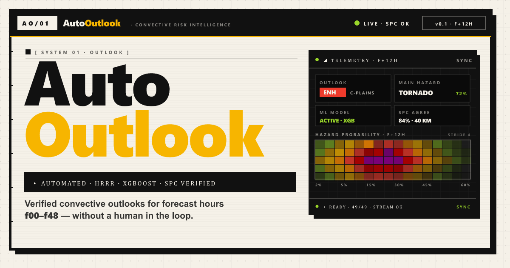

# AutoOutlook

**Automated Convective Risk Intelligence**

[](https://github.com/ShianMike/AutoOutlook/actions/workflows/free-hosting-refresh.yml)

AutoOutlook is an open-source severe-weather outlook dashboard and artifact pipeline. It turns selected HRRR model fields into SPC-style risk products, hazard probability grids, verification summaries, and a public React dashboard.

- **Live dashboard:** <https://autooutlook.tech>
- **Primary maintainer:** [ShianMike](https://github.com/ShianMike)
- **Current focus:** reproducible automated convective-risk products for forecast hours `F00-F48`
- **Status:** active early-stage OSS; APIs and generated products are experimental and not a substitute for official weather warnings



## Why this matters

Severe-weather model guidance is often hard to inspect end to end: raw GRIB2 files are large, forecast products are scattered, and generated risk areas need verification against trusted references. AutoOutlook aims to make that workflow easier to reproduce and maintain by:

- fetching only selected HRRR GRIB2 fields through byte-range filtering;
- deriving severe-weather ingredients and ML-ready feature grids;
- generating risk polygons, hazard probability tiles, metadata, preview images, and verification artifacts;
- serving finished artifacts through public API routes without forcing visitors to trigger expensive model work;
- comparing generated outlook artifacts against official SPC Day 1 data after predictions are written.

## What AutoOutlook does

- Builds deployable outlook artifacts for `F00-F48` from the latest available extended HRRR cycle.
- Runs a Vite + React dashboard for forecast-hour playback, hazard boards, environmental ingredients, readiness, model audit state, and SPC verification.
- Uses a three-tier provider chain: generated artifacts / Python backend, Open-Meteo browser fallback, then deterministic mock data.
- Computes research-grade STP, SCP, EHI, and SHIP ingredients when the selected HRRR fields support them; SHIP is marked unavailable instead of replaced with a proxy when pressure-level hail fields are missing. See [Research Formulations](docs/research-formulations.md).
- Supports cost-controlled static and API hosting through Cloudflare Pages with scheduled artifact refreshes.
- Keeps a leakage guard between model prediction and verification: official SPC outlook data is used only after prediction artifacts are generated.

## Release package

Tagged releases publish a container image to GitHub Container Registry:

```powershell
docker pull ghcr.io/shianmike/autooutlook:latest
docker pull ghcr.io/shianmike/autooutlook:v0.9
```

The image contains the built React dashboard and Python backend service from the release tag.

## Repository health

- Public GitHub repository for the full frontend, backend, scheduler, and documentation.
- Active maintenance includes forecast artifact generation, API response contracts, frontend inspection tools, scheduler reliability, and deployment documentation.
- Contributions are welcome for weather-data ingestion, verification, security hardening, documentation, and frontend inspection workflows.

## Safety and scope

AutoOutlook is a research and visualization project. It should not be used as the sole source for emergency decisions. For operational forecasts, warnings, and watches, use official products from the National Weather Service, Storm Prediction Center, and local weather authorities.

## Stack

- **Frontend**: Vite + React 18 + TypeScript + Tailwind CSS
- **Map**: `react-simple-maps` over the US states topojson
- **Data layer (3-tier provider chain)**:
  1. **Python backend** (Flask + HRRR GRIB2 byte-range filtering + MetPy-style diagnostics) — pulls selected HRRR fields, derives severe-weather ingredients, and activates XGBoost hazard probabilities when model artifacts are valid.
  2. **Open-Meteo** (browser-side) — free GFS-Seamless JSON endpoints used as an automatic fallback if the backend isn't running.
  3. **Mock** — deterministic Plains severe-weather day used when both live providers fail.
- **Deployable artifact pipeline**: `backend.ml.outlook_pipeline` detects the latest available extended HRRR cycle, processes forecast hours `0..48`, writes GeoJSON/probability/metadata/preview artifacts, computes research-grade composite predictors, then fetches the current SPC Day 1 outlook only for verification.

Designed in a neo-brutalist / RetroUI aesthetic (thick borders, hard offset shadows, bold cards, scanline overlays, monospace accents).

## Run

You'll need **two terminals** for the full live experience.

### 1) Frontend (always required)

```powershell
npm install
npm run dev
```

Vite serves on `http://localhost:5173`. The dev server proxies `/api/*` to the backend on `http://127.0.0.1:8765`.

If you stop here, AutoOutlook still works — it'll fall through to Open-Meteo, then to mock data. You'll see a `LIVE` badge for Open-Meteo and a `FALLBACK` badge for mock.

### 2) Backend (optional — for NOMADS-direct data)

One-time install of the only missing Python dependency:

```powershell
python -m pip install netCDF4
```

Everything else (Flask, flask-cors, siphon, MetPy, xarray, numpy, scipy) is already on your system.

Then either:

```powershell
.\backend\run.ps1
```

or:

```powershell
python -m backend.server
```

The service listens on `http://127.0.0.1:8765` with:

- `GET /api/forecast`
- `GET /api/health`
- `GET /api/outlook/latest`
- `GET /api/outlook/risk-polygons`
- `GET /api/outlook/aggregate-risk-polygons`
- `GET /api/outlook/probability-tiles`
- `GET /api/outlook/verification`
- `GET /api/outlook/preview.png`

When the backend is up, the dashboard's `SOURCE` badge will read the HRRR backend provider and the System Status panel will show `WINNER` next to the backend provider.

### 3) Deployable HRRR/XGBoost outlook artifacts

Generate the latest deployable outlook once:

```powershell
python -m backend.ml.outlook_pipeline
```

Run it as a scheduler loop:

```powershell
python -m backend.ml.outlook_pipeline --loop --interval-minutes 30
```

Useful runtime controls for the incremental artifact pipeline:

```powershell
$env:AUTOOUTLOOK_HOUR_WORKERS = "4"   # forecast hours processed in parallel
$env:AUTOOUTLOOK_RANGE_WORKERS = "6"  # HRRR byte-range downloads per hour
$env:AUTOOUTLOOK_GRID_STRIDE = "2"    # decoded-grid downsample stride
$env:AUTOOUTLOOK_TILE_STRIDE = "4"    # rendered probability-tile stride
```

The pipeline writes to `backend/artifacts/latest/` by default. That directory is intentionally git-ignored because it contains generated runtime artifacts.

Important leakage guard: the pipeline writes prediction artifacts first, then downloads the current official SPC Day 1 GeoJSON for verification. The official SPC outlook is never passed into the model feature matrix.

### 4) Cost-controlled production serving

Production should keep the public website online while serving only finished artifacts from the web service. Normal visitors should not trigger HRRR/NOMADS downloads, XGBoost inference, f00-f48 generation, polygon regeneration, or preview image generation.

Recommended public Cloud Run service environment:

```powershell
AUTOOUTLOOK_FORECAST_SOURCE=artifact
AUTOOUTLOOK_ENABLE_LIVE_BUILD=false
AUTOOUTLOOK_ARTIFACT_BUCKET=autooutlook-artifacts-project-f47ca9d9-31bc-4a21-963
```

With `AUTOOUTLOOK_ENABLE_LIVE_BUILD=false`, `/api/forecast` returns the latest generated artifact bundle. If artifacts are missing or incomplete, the public service returns `{"code":"outlook_not_ready"}` instead of starting expensive model work. Raw artifact storage paths are not exposed in public API errors.

If a prefix is used inside the private Cloud Storage bucket, also set:

```powershell
AUTOOUTLOOK_ARTIFACT_PREFIX=optional/path/prefix
```

Cloud Run will read objects with its service account and still expose only controlled API responses such as `/api/outlook/incremental`, `/api/outlook/incremental/hour/:hour/risk-polygons`, `/api/outlook/incremental/hour/:hour/probability-tile`, and `/api/outlook/preview.png`.

Recommended public Cloud Run service settings:

```powershell
gcloud run services update autooutlook `
  --region us-central1 `
  --min-instances 0 `
  --max-instances 1 `
  --concurrency 20 `
  --cpu 2 `
  --memory 2Gi `
  --timeout 120 `
  --cpu-boost
```

The `--timeout 120` setting is the maximum time an individual HTTP request can run before Cloud Run returns a timeout. That is enough for the public service because request handlers only serve existing JSON, GeoJSON, PNG, and frontend assets. Long HRRR/XGBoost generation belongs in the separate scheduled Cloud Run Job or a manual generation job that writes finalized artifacts for the public service to read.

Production deployment checklist:

```powershell
gcloud builds submit --config cloudbuild.yaml --project project-f47ca9d9-31bc-4a21-963
```

The build creates and pushes an image tagged with the Cloud Build ID. If the final Cloud Build deploy step fails with `iam.serviceaccounts.actAs` on `191625527569-compute@developer.gserviceaccount.com`, the image can still be deployed directly by an authenticated account with Cloud Run deploy access:

```powershell
gcloud run services update autooutlook `
  --image us-central1-docker.pkg.dev/project-f47ca9d9-31bc-4a21-963/cloud-run-source-deploy/autooutlook:<IMAGE_TAG> `
  --region us-central1 `
  --project project-f47ca9d9-31bc-4a21-963
```

When a release changes backend artifact-generation code or shared code used by the scheduled pipeline, update the hourly Cloud Run Job to the same image tag so the artifact generator and public service stay on the same revision:

```powershell
gcloud run jobs update autooutlook-artifact-refresh `
  --image us-central1-docker.pkg.dev/project-f47ca9d9-31bc-4a21-963/cloud-run-source-deploy/autooutlook:<IMAGE_TAG> `
  --command sh `
  --args "-c,python -m backend.ml.outlook_pipeline --incremental --all-hours --cycle-policy complete-requested --output-dir /tmp/autooutlook-artifacts/latest_incremental --cache-dir /tmp/autooutlook-cache/hrrr_selected --publish-gcs-bucket autooutlook-artifacts-project-f47ca9d9-31bc-4a21-963 --gcs-lock-bucket autooutlook-artifacts-project-f47ca9d9-31bc-4a21-963 --hour-workers 2 --range-workers 2 --grid-stride 2 --tile-stride 1" `
  --set-env-vars "AUTOOUTLOOK_PUBLISH_GCS_BUCKET=autooutlook-artifacts-project-f47ca9d9-31bc-4a21-963,AUTOOUTLOOK_RUN_LOCK_BUCKET=autooutlook-artifacts-project-f47ca9d9-31bc-4a21-963,AUTOOUTLOOK_HOUR_WORKERS=2,AUTOOUTLOOK_RANGE_WORKERS=2,AUTOOUTLOOK_GRID_STRIDE=2,AUTOOUTLOOK_TILE_STRIDE=1" `
  --remove-volume-mount /mnt/autooutlook-artifacts `
  --remove-volume artifacts `
  --region us-central1 `
  --project project-f47ca9d9-31bc-4a21-963
```

The job should write working artifacts to local `/tmp` and upload finished JSON artifacts through the Cloud Storage client. Avoid routing generation output through a Cloud Storage FUSE mount; it adds filesystem translation overhead and makes overlapping executions more expensive.

Do not execute the job during a normal deployment unless an immediate artifact refresh is intended. Cloud Scheduler should remain enabled on `autooutlook-artifact-refresh-30m` with schedule `0 * * * *` in `Etc/UTC`.

## Project layout

```
src/
  App.tsx                          # composes the layout
  hooks/
    useAutoForecast.ts             # fetch + 15-min refresh
    useForecastHour.ts             # slider state + play/pause + keyboard
  utils/
    fetchLatestForecast.ts         # provider chain
    providers/
      pythonBackendProvider.ts     # /api/forecast (NOMADS+MetPy)
      openMeteoProvider.ts         # browser-side Open-Meteo fallback
      mockProvider.ts              # deterministic mock
    outlookEngine.ts               # ingredients -> RiskCategory + headline
    hazardEngine.ts                # tornado/hail/wind/flood probabilities
    discussionGenerator.ts         # auto forecast-discussion paragraph
    riskTimeline.ts                # morning/afternoon/evening/overnight
    ingredientsDerive.ts           # STP/SCP/EHI/SHIP composites
    polygonBuilder.ts              # stepped risk-area rings on the map
    mockForecastData.ts            # canned 7-stop bundle
  components/
    CommandHeader.tsx
    ForecastTimeSlider.tsx
    PrimaryOutlookBanner.tsx
    OutlookMapPanel.tsx
    HazardProbabilityBoard.tsx
    EnvironmentalIngredientsGrid.tsx
    ForecastDiscussion.tsx
    RiskTimeline.tsx
    WatchReadinessPanel.tsx
    SystemStatusPanel.tsx
    retro/                         # primitives: card, badge, button, panel, divider
  types/forecast.ts                # ForecastBundle, HourSnapshot, RiskCategory, ...

backend/
  server.py                        # Flask app (port 8765)
  bundle_builder.py                # builds the JSON bundle per request
  nomads_pipeline.py               # siphon/THREDDS/NCSS access
  metpy_diagnostics.py             # bulk shear, SRH surrogate, composites
  region_picker.py                 # auto-detect CONUS focus region
  cache.py                         # 10-min TTL cache per GFS cycle
  requirements.txt
  run.ps1

public/
  us-states-10m.json               # us-atlas topojson (114 KB)
```

## Interaction model

Per spec, the **only** interactive controls are:

- **Forecast-hour slider** — 7 stops: `Current · +3h · +6h · +9h · +12h · +18h · +24h`
- **Play / Pause** — auto-steps through the slider every 1.5 s
- **Previous / Next** — single-step navigation
- **Manual refresh** (in System Status) — re-fetch from the provider chain

Keyboard shortcuts:

- `← / →` previous / next hour
- `Space` play / pause

There is no search bar, station selector, dropdown, text input, upload, or manual mode.

## Forecast hours and refresh

- 7 forecast stops: `0, 3, 6, 9, 12, 18, 24` hours from current cycle.
- Auto-refresh every 15 minutes.
- All dashboard sections (banner, map, hazards, ingredients, discussion, timeline, readiness) update automatically on slider change.

## Design tokens

Tailwind `extend` in `tailwind.config.ts` adds:

- **Risk ramp** — TSTM lime → MRGL amber → SLGT orange → ENH red → MOD dark red → HIGH violet
- **Shadows** — `shadow-retro` (6px hard offset), `shadow-retro-lg` (10px), `shadow-retro-sm` (3px)
- **Fonts** — Space Grotesk (display), Inter (body), JetBrains Mono (mono accents)
- **Animations** — `pulse-dot`, `scan` (scanline), `ticker` (header marquee)
- All animations respect `prefers-reduced-motion`.

## Adding a new provider

1. Implement `ForecastProvider` in `src/utils/providers/yourProvider.ts`:

   ```ts
   export const yourProvider: ForecastProvider = {
     id: 'yours',
     label: 'Your data source',
     async fetchBundle(signal) {
       // ...
       return bundle;
     },
   };
   ```

2. Insert it into the chain in `src/utils/fetchLatestForecast.ts` at your preferred priority.

The TS engines will run on the bundle's ingredients and produce the displayed outlook automatically.

## Future extension: AWS NODD GRIB2 provider

The plan explicitly leaves a seam for an AWS GRIB2 provider (`s3://noaa-gfs-bdp-pds`, `s3://noaa-hrrr-bdp-pds`). Recommended approach when adding it:

- Use `.idx` byte-range subsetting to fetch only the GRIB messages you need (CAPE, CIN, dewpoint, winds at levels) rather than the full 100+ MB file.
- Decode with a WASM GRIB2 reader (`wgrib2-wasm` / `eccodes-wasm`) in a Web Worker.
- Or do the same on the Python backend with `cfgrib`/`pygrib` if you prefer keeping the browser thin.

## ML dataset gathering & historical archive

To power the XGBoost severe weather probability models (tornado, hail, wind), AutoOutlook utilizes a robust dataset generation pipeline designed for aggressive, concurrent deployment across cloud providers.

- **Historical Fetching**: The `backend.ml.gather_archive` script pulls historical `.idx` and `grib2` data from AWS S3 (`s3://noaa-hrrr-bdp-pds`). It uses byte-range subsetting to fetch only critical fields instead of downloading 100+ MB files per hour.
- **Concurrent Processing**: The pipeline deploys across multiple nodes (e.g., DigitalOcean droplets for summer severe convective days, AWS instances for winter/wind events).
- **Parquet Checkpointing**: Instead of loading everything into memory, nodes continually append incremental `.ckpt.parquet` rows locally while matching Storm Prediction Center (SPC) severe reports to the precise HRRR grid valid times.
- **Data Densities**: Configurable CLI inputs like `--points-per-hour` and `--forecast-hours` allow sweeping 12-48 hour extended outlook profiles per localized report.

```powershell
python -u -m backend.ml.gather_archive --years 2021 2022 --months 4 5 6 7 --points-per-hour 30 --forecast-hours 6 12 18 24 30
```

## ML archive training guardrails

The backend only activates XGBoost hazards when model artifacts are production-capable.

- Minimum training rows: `5000`
- Feature schema hash must match runtime
- Artifacts marked `datasetQuality.experimentalOnly = true` remain inactive unless explicitly opted in
- Archive gathering defaults to de-duplicating repeated feature+label rows

Recommended flow:

```powershell
# 1) Gather larger archive sample (defaults to dedupe feature+label duplicates)
python -m backend.ml.gather_archive `
  --years 2022 2023 2024 2025 `
  --months 3 4 5 6 `
  --cycles 0 6 12 18 `
  --forecast-hours 0 1 2 3 4 5 6 7 8 9 10 11 12 13 14 15 16 17 18 19 20 21 22 23 24 `
  --points-per-hour 10 `
  --negative-points-per-hour 2 `
  --output backend/ml_data/archive_samples.parquet

# 2) Train XGBoost artifacts
python -m backend.ml.train_xgboost --input backend/ml_data/archive_samples.parquet
```

Once `trainingRows >= 5000` and schema checks pass, `/api/forecast` will automatically begin returning active `mlHazards` and non-zero `mlHazardHours`.

## Further documentation

- `docs/retro-ui.md` — neo-brutalist / RetroUI design system: color tokens, typography, borders/shadows, motion, primitives, anti-rules.
- `docs/hazard-outlooks.md` — hazard probability rendering system: dual artifact / rule-based paths, probability band ladder, and the offset + morphing SIG (significant severe) layer.

## License

AutoOutlook is released under the MIT License. See `LICENSE` for details.

## Out of scope

Skew-T, hodograph, raw data tables, manual inputs, dropdowns, search, station selectors, uploads, editable fields, rawinsonde-style tabs, glassmorphism, generic SaaS dashboard look.
